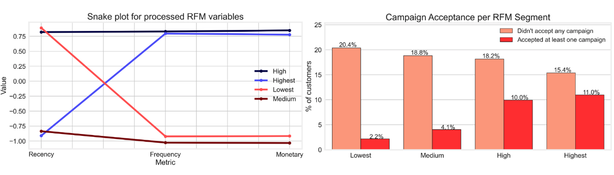
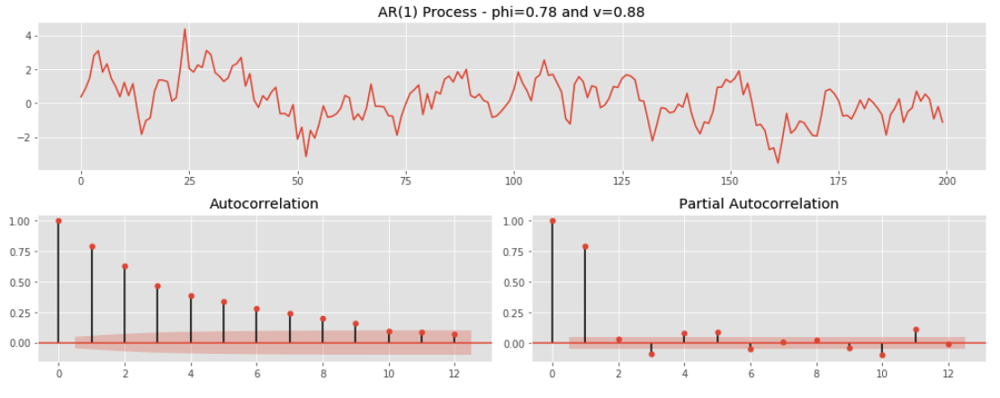
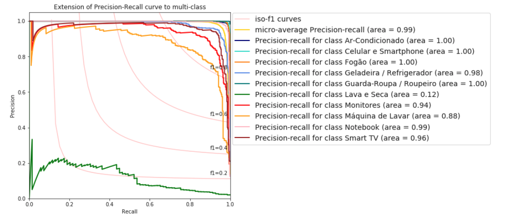
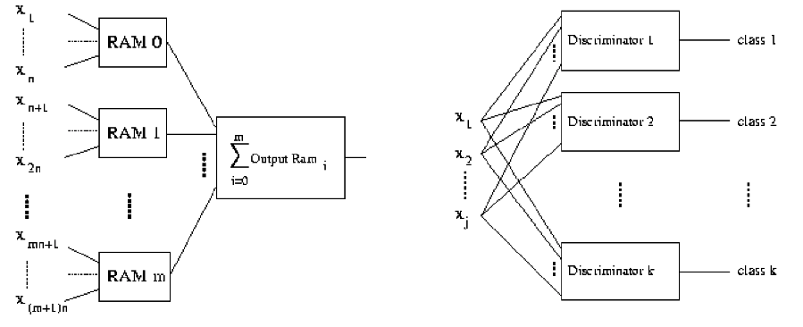
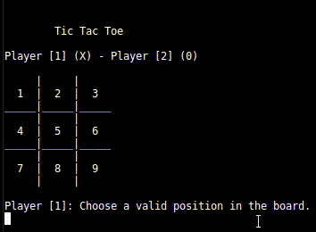

# Portfolio
---
## Marketing Campaing Optimisation 

### Case study from iFood's Data Science Marketing team

This is the submission which got me into one of the biggest startups in Brazil.  
I developed two approaches to find optimal customers (persuadable customers) to reduce campaign costs - RFM Segmentation and a supervised machine learning.

**Recency, Frequency and Monetary Value (RFM) Segmentation:** A segmentation with an unsupervised learning technique using our customer's Recency, Frequency, and Monetary (RFM) values was proposed. The goal is to segment our customers into different groups based on their RFM values and find the segment with the best customers (which in this case also seem to be the respondents)..

**Supervised Learning Approach:** Through the use of machine learning a model able to predict whether a customer will accept a marketing campaign or not was developed. The model was used as a tool to improve the marketing team decision making to contact or not different customers, reducing the total cost contact and increasing the marketing campaign ROI and success rate..

---
## Time Series Analysis and Forecasting

### SME808: Time Series and Dynamic Learning

My complete implementation of assignments and projects in [***SME808: Time Series and Dynamic Learning***] by Universidade de São Paulo (March, 2020).

**Time Series EDA** ([GitHub](https://github.com/leoMurtha/Series-Temporais-e-Aprendizado-Dinamico-SME0808/blob/master/notebooks/P1.ipynb))
  
* Trend : A long-term increase or decrease in the data. This can be seen as a slope (is doesn’t have to be linear) roughly going through the data.  

* Seasonality : A time series is said to be seasonal when it is affected by seasonal factors (hour of day, week, month, year, etc.). Seasonality can be observed with nice cyclical patterns of fixed frequency.  

* Cyclicity : A cycle occurs when the data exhibits rises and falls that are not of a fixed frequency. These fluctuations are usually due to economic conditions, and are often related to the “business cycle”. The duration of these fluctuations is usually at least 2 years.  

* Residuals : Each time series can be decomposed in two parts:  
  A forecast, made up of one or several forecasted values, Residuals. They are the difference between an observation and its predicted value at each time step.

**ARIMA/Bayesian Modelling:** ([GitHub](https://github.com/leoMurtha/Series-Temporais-e-Aprendizado-Dinamico-SME0808/blob/master/notebooks/P2.ipynb))  
Implementation of ARIMA models (AR, MA...) on simulated time-series.

**Dynamic Linear Models:** ([GitHub](https://github.com/leoMurtha/Series-Temporais-e-Aprendizado-Dinamico-SME0808/blob/master/notebooks/P3.ipynb))  
Implementation of DLM models on the classic Box & Jenkins airline data, monthly totals of international airline passengers, 1949 to 1960.

---
### Product Classification based on E-commerce’s descriptions

**What was done:** Crawlers that retrieved data from 4 brazilian e-commerce websites, basic NLP pipeline (+TF/IDF), non-balanced dataset treatment, and exploration of different classes of models (Naïve Bayes, SVM, MLPs...)

---
### Random Acess Memory Neural Network

RAM Neural Net implemented in C and was trained using genetic algorithms to play Tic-Tac-Toe

 

---

© 2020 Leonardo Meireles. Powered by Jekyll and the Minimal Theme.

